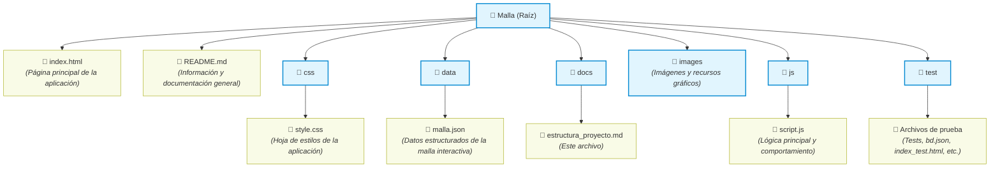

# Plantilla-malla-interactiva

Propuesta de proyecto de agrupación "IEEE SB UFRO" que consta de la creación de mallas interactivas para INELE.

### Tecnologías utilizadas

### Estado del proyecto

Actualmente el proyecto se encuentra en fase temprana teniendo proncipalmente el estilo de la malla de referencia en PDF en HTML.
La siguiente imagen es la malla en HTML.

Además se están realizando diseños de base de datos y explorando formas visualmente acordes para visaulizar los pre requisitos de los ramos.

### Estructura del proyecto

### To-do

- [x] Crear repositorio común
- [x] Adaptar referencia de malla PDF a HTML inicial
- [ ] Crear base de datos de los ramos (Puede ser una lista, sqlite, localstorage, etc)
  - [ ] Programar funciones CRUD
  - [ ] Rescatar bd de proyecto Cristóbal como base para estándar
  - [ ] Programar la bd con la interfaz para que sea fácilmente adaptable a otras carreras
- [ ] Desarrollar Interactividad básica (como ver info de cada ramo)
  - [ ] Adaptar proyecto para implementar funciones JS
  - [ ] Que las cajas de ramo reaccionen ante el cursor
- [ ] Implementar Pre-requisitos de cada ramo
  - [ ] Visualizar conexión con ramos pre requisitos.
- [x] Testear en iFrame para exportar a una web externa

#### Opcionales

- [ ] Agregar diferenciación de ramos Caso Telemática (Ej: Rama electrónica, software, redes, etc...)
  - [ ] Adaptar sub clases de los elementos "course-box"

### Autores 
- Cristóbal Suarez
- Patricio Calisto 
- Nicolás Vásquez
