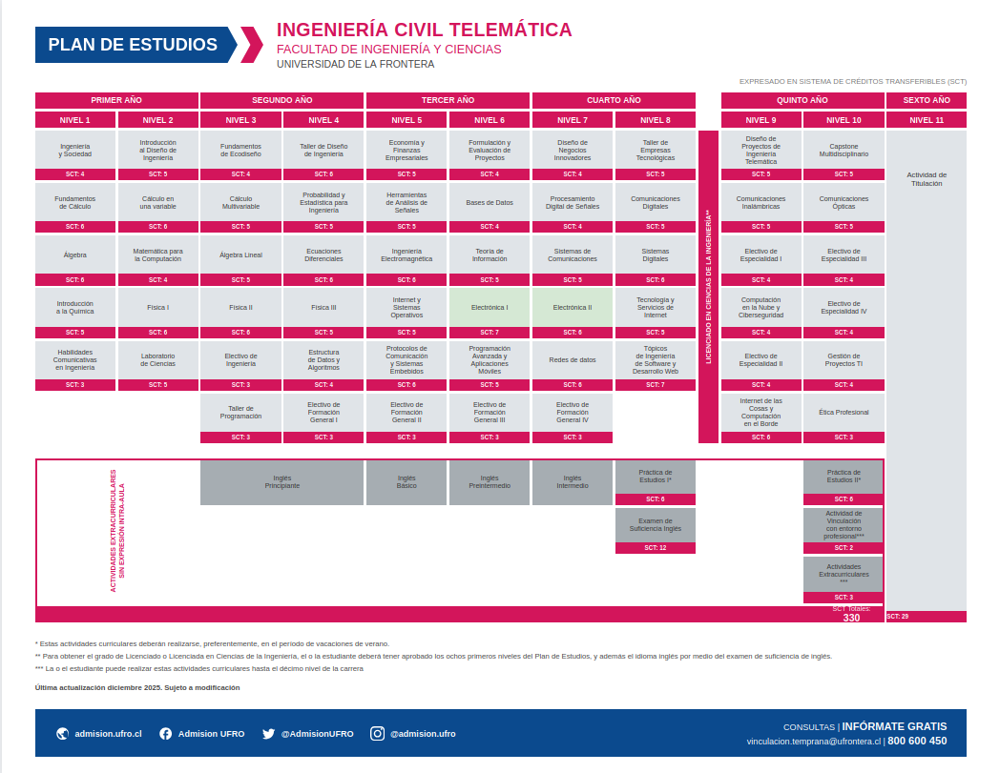
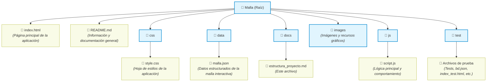

# Plantilla-malla-interactiva

Propuesta de proyecto de agrupación "IEEE SB UFRO" que consta de la creación de mallas interactivas para INELE.

## Manual de uso
Para empezar debes clonar el repositorio:
```
git clone https://github.com/Nivaspexs/Plantilla-malla-interactiva.git
```

Para probar la malla interactiva puedes simplemente abrir el "index.html" con tu browser.

A preferencia puedes ocupar live-server desde vs-code o iniciar live-server desde la terminal (en la carpeta del proyecto) utilizando npx:

```npx
npx live-server
```

Ahora, para probar el test iniciado el live-server accede a:

```
http://127.0.0.1:8080/test/index_test.html
```

### Adaptar malla a otras carreras

Para importar la malla de otras carreras, se debe modificar el JSON en 'data/malla.json' siguiendo la estructura:

Los ramos se introducen en los niveles (se debe seguir el nombre "nivelN°"), los niveles van a su vez en malla.

Los ramos tienen nombre en html para acomodarse a la interfaz, tiene código para identificarse, SCT, una descripción y los pre requisitos para relacionar los ramos.

En 'data/malla.json' hay una plantilla/ejemplo utilizando la carrera de ICT, ¡Prueba agregando otros ramos!

```json
{
  "facultad": "Facultad de Ingeniería y Ciencias",
  "carrera: "Ingeniería Civil Telemática",
  "paletaColores":[],
  "malla":{
    "nivel1":
    [
      {
      "ramo_nombre_html": "Ingeniería<br>y Sociedad",
      "codigo":"ING050", 
      "sct": 4   ,
      "descripcion": "Primer ramo del LIFIC",
      "pre-requisitos": []
      }
    ]
  }
}
```

### Cómo agregar malla como iFrame: Ejemplo

En la carpeta 'test/' existe un ejemplo en HTML donde se incluye la malla como un iframe.
Puedes acceder al ejemplo accediendo a:

```
http://127.0.0.1:8080/test/iframe_test.html
```


## Tecnologías utilizadas


### Estado del proyecto

Actualmente el proyecto se encuentra en fase de experimentación con animaciones y carga de malla interactiva para ramos con pre-requisitos.




### Estructura del proyecto



### To-do

- [x] Crear repositorio común
- [x] Adaptar referencia de malla PDF a HTML inicial
- [ ] Crear base de datos de los ramos (Desde JSON)
  - [x] Rescatar bd de proyecto Cristóbal como base para estándar
  - [x] Cargar malla desde el JSON 
  - [ ] Programar funciones CRUD
- [ ] Desarrollar Interactividad básica
  - [x] Adaptar proyecto para implementar funciones JS
  - [x] Que las cajas de ramo reaccionen ante el cursor
  - [ ] Agregar info de cada ramo
- [ ] Implementar Pre-requisitos de cada ramo
  - [x] Que la bd soporte pre requisitos
  - [ ] Visualizar conexión con ramos pre requisitos.
- [x] Testear en iFrame para exportar a una web externa

#### Opcionales

- [ ] Agregar diferenciación de ramos Caso Telemática (Ej: Rama electrónica, software, redes, etc...)
  - [ ] Adaptar sub clases de los elementos "course-box"
- [ ] Agregar que la paleta sea dinámica por Facultad


### Autores 
- Cristóbal Suarez
- Patricio Calisto 
- Nicolás Vásquez
