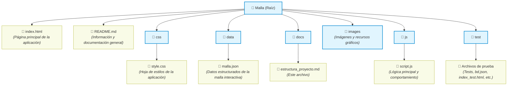

# Estructura del Proyecto

A continuación se presenta un diagrama simple que explica la estructura y los archivos principales del proyecto.

```mermaid
graph TD
    Root["📁 Malla (Raíz)"]
    
    Root --> HTML["📄 index.html<br><i>(Página principal de la aplicación)</i>"]
    Root --> README["📄 README.md<br><i>(Información y documentación general)</i>"]
    
    Root --> CSS["📁 css"]
    CSS --> CSS_File["📄 style.css<br><i>(Hoja de estilos de la aplicación)</i>"]
    
    Root --> Data["📁 data"]
    Data --> Data_File["📄 malla.json<br><i>(Datos estructurados de la malla interactiva)</i>"]
    
    Root --> Docs["📁 docs"]
    Docs --> Docs_File["📄 estructura_proyecto.md<br><i>(Este archivo)</i>"]
    
    Root --> Img["📁 images<br><i>(Imágenes y recursos gráficos)</i>"]
    
    Root --> JS["📁 js"]
    JS --> JS_File["📄 script.js<br><i>(Lógica principal y comportamiento)</i>"]
    
    Root --> Test["📁 test"]
    Test --> Test_Files["📄 Archivos de prueba<br><i>(Tests, bd.json, index_test.html, etc.)</i>"]

    classDef folder fill:#e1f5fe,stroke:#0288d1,stroke-width:2px;
    classDef file fill:#f9fbe7,stroke:#afb42b,stroke-width:1px;
    
    class Root,CSS,Data,Docs,Img,JS,Test folder;
    class HTML,README,CSS_File,Data_File,Docs_File,JS_File,Test_Files file;
```
